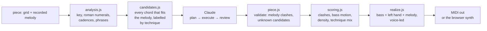

# Voicing Lab

[](https://github.com/EdiTnss/Voicing-Lab/actions/workflows/test.yml)

**The teacher who sits next to you and tells you what your hands got wrong.**

Voicing Lab listens to what you play on a MIDI keyboard and answers in under 100 ms: which
voicing you used, which chord tones are missing, which notes are wrong, where the left hand is
too low to sound clear, and how smoothly you moved from the chord before.

Everything in that answer is computed, not guessed. No model is asked what a Dm7 is.

**[Try it →](https://editnss.github.io/Voicing-Lab/)** — no MIDI keyboard needed: click the
drawn keys to build a voicing and press <kbd>Enter</kbd>, or hold <kbd>A</kbd> <kbd>S</kbd>
<kbd>D</kbd> <kbd>F</kbd> like a piano. Chrome or Edge; Web MIDI does not exist in Safari.

<!-- demo.gif -->

## How the analyzer works

A chord symbol is parsed into chord tones, available tensions and avoid notes; the notes you
played are matched against it, and the result is a list of messages in a fixed order — what is
wrong first, what is missing next, then what you actually built.

| You are asked for | You play | It answers |
|---|---|---|
| `Dm7` | F2 A2 C3 E3 | Rootless voicing (no D) · **Muddy: F2–A2 (M3) is too low** · **Muddy: A2–C3 (m3) is too low** · Rootless A |
| `Cmaj7` | C4 F4 G4 B4 | **Missing E (3)** · **Avoid note: F (11)** · Close position |
| `Dm7` | E3 A3 D4 F4 | **Missing C (b7)** · Drop 2 |

The low interval limits in the first row are the point: the voicing is correct on paper and
muddy under the hands. The rules are written down in [docs/spec-analyzer.md](docs/spec-analyzer.md)
and each one has a test.

Beyond a single chord, the app runs a drill (random chords from the qualities and keys you pick),
progressions from a small library or from a grid you type (`| Dm7 G7 | Cmaj7 | % |`), free or
against a metronome, with a voice-leading score for the pass and statistics for your weak spots.

## The hybrid reharmonizer

A second, separate thing this repo demonstrates: a language model placed where it is actually
good, and kept out of everywhere else. You record a melody over your grid, and Claude
reharmonizes the tune without touching a note of the melody.



**Why not just ask the LLM?** Because a model asked for "a tritone sub in bar 5" will happily
return a chord that clashes with the melody note held over it, and you cannot tell which of its
answers did. Here the code generates every chord that fits the melody, labelled by technique;
the model only picks from that menu and says why; then the code validates the picks and scores
the result. What the model is good at — taste, shape across a phrase, an explanation in words —
is what it is asked for.

It is measured, not asserted. `eval/compare.js` runs the same tune through `execute` alone and
through `plan + execute + review`, several times, and writes the numbers to
[`eval/reports/`](eval/reports/). On a 64-bar study, three runs of each, the full pipeline
averaged 0.90 bass smoothness against 0.84 and 4.67 distinct techniques against 3.67 — with zero
melody clashes and the change density inside its target in every run of both.

Reharmonization is **out of the product's scope** (see [docs/PRODUCT.md](docs/PRODUCT.md)): it
stays here as the technical demonstration, and the published site makes no API calls at all.
Run it yourself with your own key and it comes back on.

## The verification harness

The app records the last hour of playing in memory — every note, every verdict — and "Save
session" writes it out as JSON. [`harness/replay.js`](harness/replay.js) replays those sessions
through the same capture and analysis code on a virtual clock and reports every snapshot whose
chord or verdict is no longer what it was.

CI replays three of them on every push, including eleven minutes of real playing on a Genos
(1160 events, 93 snapshots). It has already earned its keep: it found a chord pushed over the
bar line that silently received no verdict at all, and proved the fix left all 93 snapshots of
that session untouched.

## Run it

```bash
npx serve .
```

Open <http://localhost:3000> in Chrome or Edge. On Windows, `start.cmd` does this and opens the
browser for you. `midi-test.html` is a diagnostic page for MIDI in and out.

No keyboard? The drawn one plays: click keys to arm them and press <kbd>Enter</kbd>, or type on
the letter row. A small Web Audio synth appears as a MIDI output, so suggestions and whole
arrangements are audible in the browser.

**With a keyboard:** connect it before loading the page (or press "Connect MIDI keyboard"), pick
it as the MIDI output in Settings, and turn off any auto-accompaniment so only your own notes
arrive.

**To turn on the Claude features** (explanations in the drill, reharmonization), run the proxy
from [`worker/`](worker/) with your own Anthropic API key and paste its URL into Settings. The
key never touches the frontend or this repository — see [worker/README.md](worker/README.md).

## Tests

```bash
npm test          # full report
npm run test:quiet  # one line when green
```

229 tests, Node 22+, **no dependencies**. The music theory in `src/theory/` is pure JavaScript
with no DOM, which is why the same code runs in the browser, in the Worker and under
`node --test`.

## Layout

| | |
|---|---|
| `src/theory/` | chords, analyzer, voice leading, pieces, harmonic analysis, candidates, scoring, realization — pure, tested |
| `src/midi/` | Web MIDI in and out, voicing capture, the virtual port |
| `src/audio/` | metronome, synth, the shared clock |
| `src/ui/` | rendering, the drill, the session tape, the on-screen keyboard |
| `src/ai/` | the prompts (versioned, in the repo) and the pipeline |
| `worker/` | Cloudflare Worker: adds the key, checks the origin, limits per IP. No music logic, no prompts |
| `harness/` | recorded sessions and the replay |
| `docs/` | product scope, module specs, the session journal (in Romanian) |

## License

None. All rights reserved — the code is here to be read, not reused.
